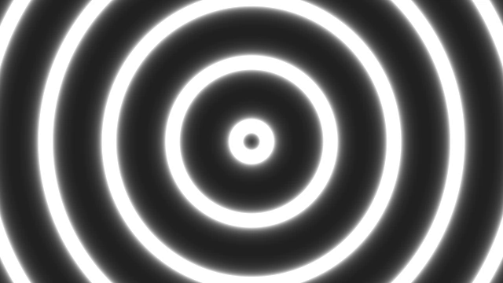
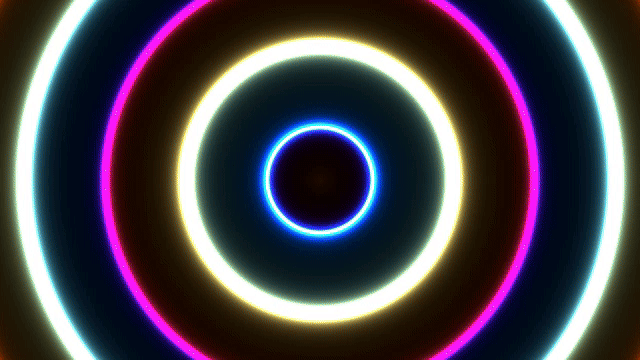
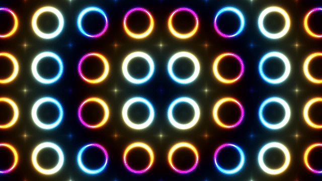

# shader-art
Exploration of using code to create shader art/animation.

Based on [An Introduction to Shader Art Coding](https://www.youtube.com/watch?v=f4s1h2YETNY) by kishimisu.

## Final Result

The final animation looks like the above `.gif`. For a better viewing experience and 60 fps, do one of the following:
1. View it on ShaderToy by following the steps in [Reproducing These Results](#reproducing-these-results) below.
2. Download and view the [`webm` version](videos/final.webm).

## Components
Here are the main steps used to create the final animation.

### 1. Expanding Circles

First, simple concentric circles are drawn. The expansion animation is achieved using the `sin` function and the global GLSL time parameter `iTime`.

### 2. Inverting Intensity

To make the circles look like they're glowing, the color intensities are inverted and the `smoothstep` function is used to fade the circle edges.

### 3. Adding Color

Colors are added by using a cosine gradient color palette and changing color based on distance to the center of the canvas.

### 4. Adding Tiling

The expanding circle animation is repeated in a tile pattern using the `fract` function. The colors aren't affected by the tiling and still radiate from the canvas center.

### 5. Multi-layer Tiling

By putting the tiling and drawing functions in a loop, the tiling can be repeated (infinitely, if desired). This creates much more complex patterns.

### 6. Final Tweaks and Adjustments

Certain aspects are adjusted to prevent too much visual overload. For example, the `pow` function was used to tune contrast, and the `exp` function was used to blur parts of the animation.

## Reproducing These Results
To reproduce these results for yourself, go to [ShaderToy](www.shadertoy.com) and simply copy-paste the contents of `sun_halo.glsl`. Press `Alt+Enter` in the ShaderToy editor window to compile.

Feel free to make any modifications for your own purposes (MIT license).